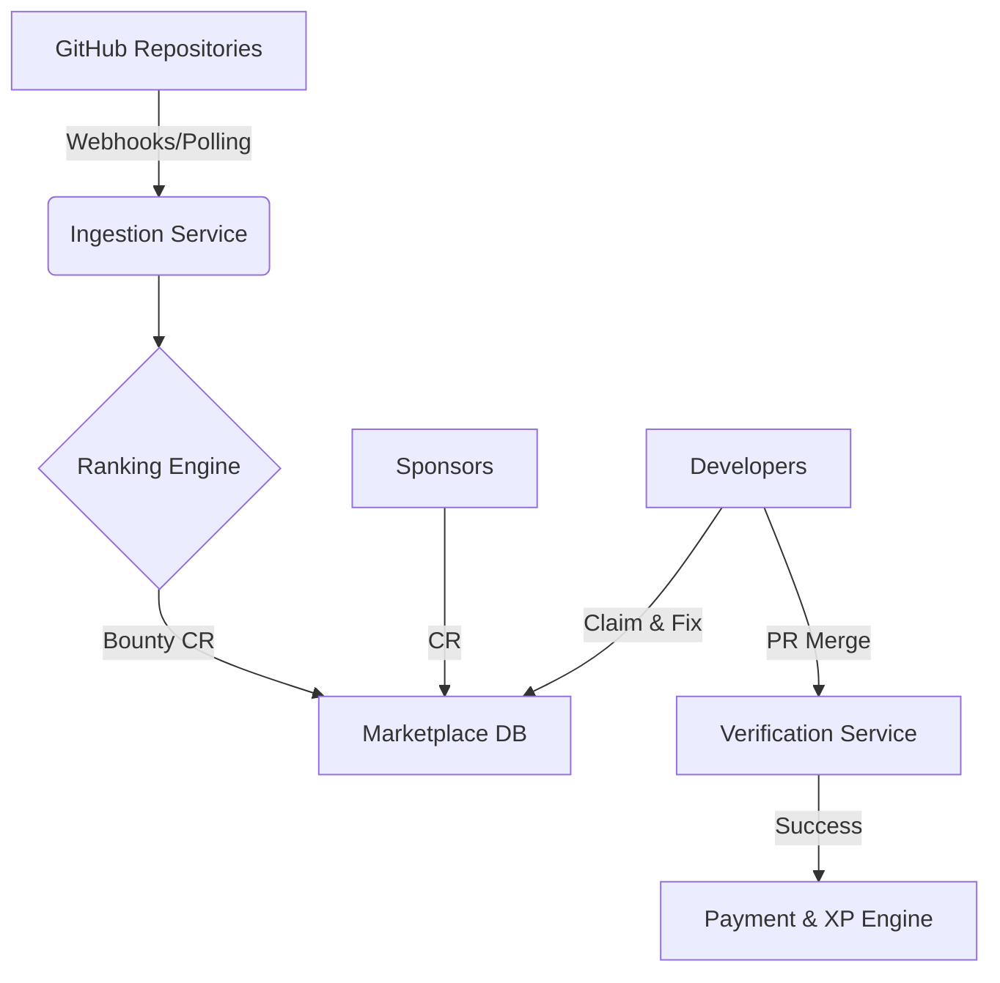

# System Architecture

**WANTED** is built as a modular system with distinct services for ingestion, processing, and user interaction.

## High-Level Data Flow

## Core Modules

### 1. Ingestion Service
*   **Role**: Listens to GitHub events (Issue Created, PR Merged) and polls opted-in repositories.
*   **Tech**: Node.js, GitHub App API.
*   **Output**: Raw issue data stored in PostgreSQL.

### 2. Ranking Engine (The Brain)
*   **Role**: Analyzes issue text, labels, and repo activity to assign a "Difficulty Score" and "Impact Score".
*   **Logic**:
    *   `Rookie`: Good first issues, typos, docs.
    *   `Architect`: Breaking changes, core architecture, complex refactors.
*   **Tech**: Python (FastAPI), NLP / LLM Agents.

### 3. Marketplace (The UI)
*   **Role**: Displays ranked issues to developers. Allows filtering by stack, bounty, and difficulty.
*   **Tech**: Next.js, Tailwind CSS.
*   **Features**:
    *   Real-time bounty updates.
    *   "Claim" locking mechanism (24h reservation).

### 4. Reward System
*   **XP Engine**: Calculates experience points based on difficulty and speed.
    *   *Formula*: `XP = (Difficulty * 100) + (SpeedBonus)`
*   **Payments**: Handles payouts via Stripe Connect. Funds are released only after the maintainer merges the PR.

## Database Schema (Simplified)

*   **Users**: `id`, `github_id`, `xp`, `rank`, `wallet_balance`
*   **Issues**: `id`, `repo_id`, `title`, `difficulty`, `bounty_amount`, `status` (OPEN, CLAIMED, PAID)
*   **Bounties**: `id`, `issue_id`, `sponsor_id`, `amount`, `currency`

## Security Considerations

*   **OAuth**: strict GitHub authentication.
*   **Webhooks**: Verified signatures to prevent spoofing.
*   **Payouts**: Held in escrow (or logically locked) until verifiable merge events.
